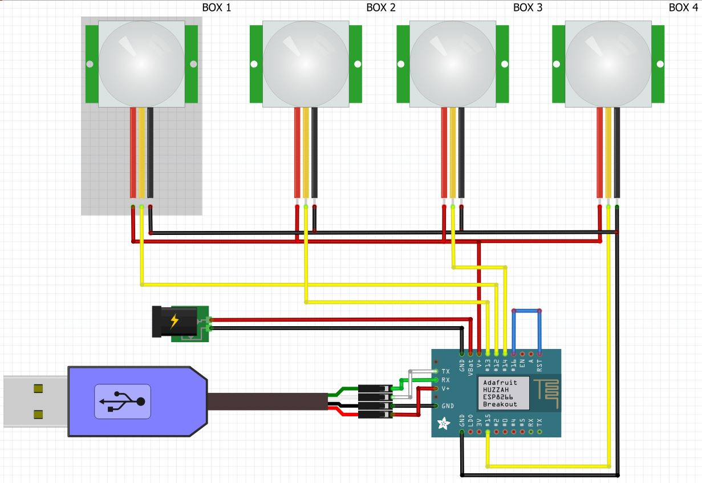
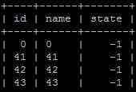
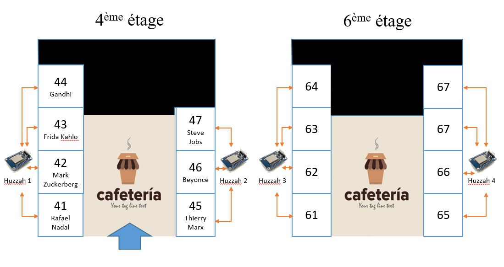
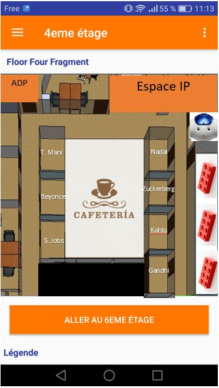
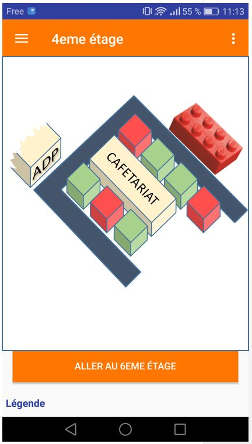

# DispoBox #

##1. Objectif ##
Détecter la présence de personnes dans les box et afficher l'état de toutes les box sur une _appli android/page web_ (cartes 4ème et 6ème étage, rouge = occupé = etat 1, vert = libre = etat 0, gris = aucune info/système éteint = etat -1).

##2. Fonctionnement générale ##

Chaque étage comporte plusieurs boitiers wifi. Chaque boitier contient une carte wifi Arduino Huzzah, reliée à plusieurs détecteurs de présence, alimenté sur le secteur.
Le boitier se connecte au wifi et envoie l'état des box sur un serveur local, qui reçoit les infos en TCP grâce à un script python et les stockent dans une base de données MySQL. 
Le serveur fait également tourner un serveur web qui lui permet de communiquer avec l'appli Android.

##3. Branchements Arduino ##

  

Capteurs infra-rouge 

Box 1 = pin 12

Box 2 = pin 13

Box 3 = pin 14

Box 4 = pin 15

La PIN 16 est reliée à RST : c'est obligatoire pour que le Huzzah puisse se mettre et sortir du mode _deep sleep_.

### Electronique ###
Quelques manipulations sont à faire : il faut relier toutes les masses des capteurs IR et toutes les alimentations, puisqu'on a une seule sortie sur le Huzzah. Pour chaque capteur, il faut également préparer les cables (dénuder et mettre les embouts adéquat).

##4. Fonctionnement programme par programme ##
###     - Serveur Python ###
Le serveur python tourne sur le server. Connecté au wifi de la LAN visiteur d'Extia (Wifi-int4 ou Wifi-int6), comme les modules de détection Arduino.
Le serveur crée une connexion TCP et attend des connexions.

IP : 150.16.21.40

Mask: 255.255.255.128

GW: 150.16.21.1   

USER du serveur : polinno

MDP : boxdispo

**Fonctionnement des thread et process**

Trois thread sont lancés automatiquement, et un nouveaux process de communication est crée dès qu'un nouveau matériel se connecte en TCP.
- _main_ : crée la connexion TCP, se connecte la base de données SQL _nomdeladb_ , lance le thread _active_con_ et attend qu'on appuie sur une touche pour fermer toutes les connexions et arréter le programme.
- _active_connexion_ : ouvre une connexion TCP et attend que quelqu'un se connecte. A chaque connexion, crée un process propre à la connexion qui gère la connexion. Elle reçoit l'état des capteurs et met ces infos dans la base de données _nomdeladb_. En dehors des heures de fonctionnement, elle met le huzzah en mode _deep sleep_.
- _MAJ_current_state_ : boucle qui récupère chaque nouvelle valeur dans la queue pour la mettre à jour dans la base de données SQL.

**MySQL**

Identifiants de la BDD MySQL : <i>user</i> - <b>root</b> ; <i>pwd</i> - <b>polinno</b>

***DATABASE***
dispobox

***TABLES***
current_state : regroupe l'état courant de chaque box

  

stats : garde toutes les infos depuis le début du lancement du projet.

  

### - Code Arduino HUZZAH ###
Chaque Huzzah est connecté à 3 ou 4 détecteurs de présence.
- Connexion au réseau TCP : la librairie [ESP8266WiFi.h](https://github.com/ekstrand/ESP8266wifi) permet de communiquer en wifi. 
- La fonction _setup()_ : connexion au réseau wifi, puis crée la connexion TCP.
- La fonction _loop()_ : reçoie les infos du serveur. Il peut envoyer deux types de messaes, soit *datas* dans quel cas on renvoi l'état courant des capteurs IR, soit un nombre, correspondant au nombre de secondes pendant lesquels le module doit se mettre en _deep sleep_.

### - Serveur web ###
- URL access : http://150.16.21.40/dispobox/
- Project directory : /var/www/html/dispobox/

_Server config_
- config/config.t : DB config
- config/create_database.sql : Create table query
- init.inc.php : Autoload init + custom error handler

_Lib_
- class/ActionHelper.php : Main WS handler
- class/DataDecoder.class.php : json encoder/decoder
- class/DBHelper.class.php : MySQL query helper

- main access : index.hp

_General WS use_
- WS use : http://150.16.21.40/dispobox/?action=[ACTION_NAME]&data=[DATA]

- ACTION_NAME = WS action name
- DATA = WS action data (with json format)

- Return : data with json format
- JSON Struct. :
    - code : return code (if code < 0 : something go wrong with action)
    - message : general message (use when there is an error)
    - data : data result for WS action
- Sample : {"code":0,"message":"","data":[]}

_Model_
- class/Box.class.php

### _Currents WS Actions_ ###
- name : getAllBoxes
- URL : http://150.16.21.40/dispobox/?action=getAllBoxes
- Return : json
- Return sample :
{"code":0,"message":"","data":[{"id":"0","state":1,"name":"0"},{"id":"41","state":1,"name":"41"},{"id":"42","state":1,"name":"42"},{"id":"43","state":1,"name":"43"}]}
- ActionHelper method called : getAllBoxesAction()

### - Appli mobile ###

##5. Numérotation des box par étage ##

  

### - Appli mobile ###

<<<<<<< HEAD
L'application mobile Android permet d'afficher en temps réel la disponibilité des salles grace aux web services fournit par le serveur Web.

** JAVA **

	- Package activities 

		* MainActivity.java : activity principale de l'application.
		
	- Package fragments (ensemble des fragments sont relié à l'acticity principale)

		* MainFragment.java : fragment d'accueil de l'application.
		* FloorFourFragment.java : fragment de l'étage 4. 
		* FloorSixFragment.java : fragment de l'étage 6. 
		* SettingFragment.java : fragment qui permet le changement dynamique de l'IP du serveur web fournissant les webservices.
		
	- Package constants (utile afin de ne modifier qu'à un seul endroit des données si besoin)

		* Constants.java : fichier ou se trouve l'ensemble des constantes de l'application.

	- Package adapters 

		* MenuAdapter.java : permet d'afficher la liste des items présent dans le menu drawer.
		
	- Package models

		* MenuData.java : model qui permet de créer un item du menu avec son image et son label.
		
	- Package tools (utilisation des librairies dans le code)

		- Package retrofit 
		
			- Package interfaces 
			
				* WebServicesInterface.java : permet de lister l'ensemble des web services à contacter 
				
			- Package models
			
				* Salle.java : permet d'avoir l'ensemble des données pour une salle. 
				
			- Package services
				
				* GetAllBoxes.java : permet de récupérer l'ensemble des informations fourni pour le web service
				
			- Package settings
			
				* ServerServicesProvider.java : permet de configurer la librairie Retrofit pour l'appel aux web services. 
				
** XML **

	- Package drawable (ensemble des images de l'application)
	
	- Package layout (ensemble des vues de l'application)
		
		* activity_main.xml : layout pour la classe MainActivity.java
		
		* fragment_floor_four.xml : layout pour le fragment FloorFourFragment.java
		* fragment_floor_six.xml : layout pour le fragment FloorSixFragment.java
		* fragment_main.xml : layout pour le fragment MainFragment.java
		* fragment_setting.xml : layout pour le fragment SettingFragment.java
		
		* item_data_menu.xml : layout pour un item du menu Drawer
		
		* view_empty_list_message.xml : layout pour afficher a l'ecran un message d erreur 
		* view_error_message.xml : layout pour afficher a l'ecran un message d erreur 
		* view_unknow_message.xml : layout pour afficher a l'ecran un message d erreur 
		
		* view_loading_screen.xml : layout pour afficher un loader (utiliser lors des chargements des données via les web services et retrofit)
		
	- Package values (ensemble des valeurs de l'application)
	
		* colors.xml : valeur pour les couleurs.
		* dimens.xml : valeur pour les dimmentions en fonction des ecrans.
		* strings.xml : valeur pout les textes traduisibles.
		* styles.xml : style pour un composant présent dans un layout. 
		
** Gradle **

	- build.gradle (Module:app) : Ajout de l'ensemble des librairies utilisés dans l'applications 
	
		* com.android.support:design:24.2.1 : Librairie material deign pour des composants dans les layouts
		* com.squareup.retrofit2:retrofit:2.1.0 : Librairie retrofit pour contacter les webservices
		* com.google.code.gson:gson:2.6.2 : Librairie utile pour l'utilisation de retrofit
		* com.squareup.retrofit2', name: 'converter-gson', version: '2.1.0' : Librairie utile pour l'utilisation de retrofit
    
** Generate APK **

	- Android studio :
		* Menu Build -> Build Apk
		* APK in folder (projectName)\app\build\outputs\apk
		
	- Envoyer l'apk par e-mail au personne souhaité 
	
	- Paramètrage du device Android 
		* Paramètre -> Sécurité -> Autorisé les app de sources inconnues 
		
	- Reception du mail téléchargement de l'apk et installation 
	
	- Générer un nouvelle APK aprés chaque mise à jour importante de l'app
** L'IHM **
L'IHM actuelle est la suivante :

  

Elle n'est pas très intuitive et risque de perdre les utilisateurs. Il faut trouver une meilleure solution.

Voici quelques propositions, laides mais pouvant donner des idées :

  
  
  

##6. Les boitiers à imprimer en 3D ##
On a deux types de boitier, l'un pour placer le Huzzah et bloquer les fils, l'autre pour accrocher les capteurs IR au plafond :
Carter pour Huzzah : https://github.com/MakersExtia/DispoBox/blob/master/Modeles%203D/carter_moyen.stl
Boitier pour capteur IR : https://github.com/MakersExtia/DispoBox/blob/master/Modeles%203D/support_IR.STL

